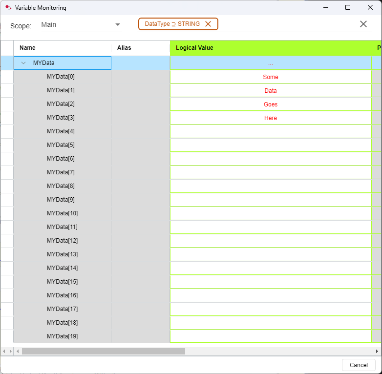

# JSONMaker_V2 UDFB for Rockwell Micro850 (ST)

## Overview
`JSONMaker_V2` is a User Defined Function Block (UDFB) written in Structured Text for Rockwell Micro850 PLCs. It concatenates an input array of strings into a single JSON-formatted string, using custom keys from the `InputNames` array if provided, or falls back to keys "A" through "T" for up to 20 elements. Only non-empty strings are included in the output JSON.


## Features
- Accepts an input array of up to 20 strings (`InArray`), each up to 32 characters.
- Accepts an optional array of up to 20 string keys (`InputNames`), each up to 32 characters.
- Outputs a JSON string (`JsonString`) with keys from `InputNames` if provided, otherwise uses "A" to "T".
- Skips empty strings in the input array.
- Designed for use in Connected Components Workbench (CCW) with Micro850 PLCs.
- Controlled by enable (`FBEN`) and done (`FBENO`) flags.

## Function Block Interface

### Input Array


- `InArray : ARRAY[0..19] OF STRING[32]`  
  The array of strings to be concatenated into JSON.
- `InputNames : ARRAY[0..19] OF STRING[32]`  
  Optional array of key names for each input. If blank, the key defaults to "A"-"T".
- `FBEN : BOOL`  
  Set to `TRUE` to enable execution of the function block.

### Output JSON


- `JsonString : STRING[255]`  
  The resulting JSON string.
- `FBENO : BOOL`  
  Set to `TRUE` when the function block has completed execution.

### Function Block Variables


## How It Works
1. When `FBEN` is set to `TRUE`, the function block starts execution.
2. It initializes the output string as a JSON object (`{"`).
3. It loops through each element of `InArray` (indices 0 to 19):
    - If the string is not empty, it adds a key-value pair to the JSON string.
    - The key is taken from `InputNames[i]` if not blank, otherwise it is a letter from "A" (index 0) to "T" (index 19).
    - Commas are added between entries as needed.
4. The JSON string is closed with a `}`.
5. `FBENO` is set to `TRUE` to indicate completion.

## Example

Suppose you have the following input:

```pascal
InArray[0] := 'Apple';
InArray[1] := '';
InArray[2] := 'Banana';
InArray[3] := '';
InArray[4] := 'Cherry';
InputNames[0] := 'fruit1';
InputNames[2] := '';
InputNames[4] := 'fruit3';
// ... rest are empty
FBEN := TRUE;
```

After execution, `JsonString` will be:

```json
{"fruit1":"Apple","C":"Banana","fruit3":"Cherry"}
```

## Usage Notes
- Only non-empty strings are included in the output JSON.
- The output string is limited to 255 characters. If the total JSON exceeds this, it will be truncated.
- The function block must be called with `FBEN := TRUE` to execute. `FBENO` will be set to `TRUE` when done.
- Designed for use in Micro850 PLCs with Structured Text (ST) in CCW.

## License
This code is provided as-is for educational and industrial automation purposes.
